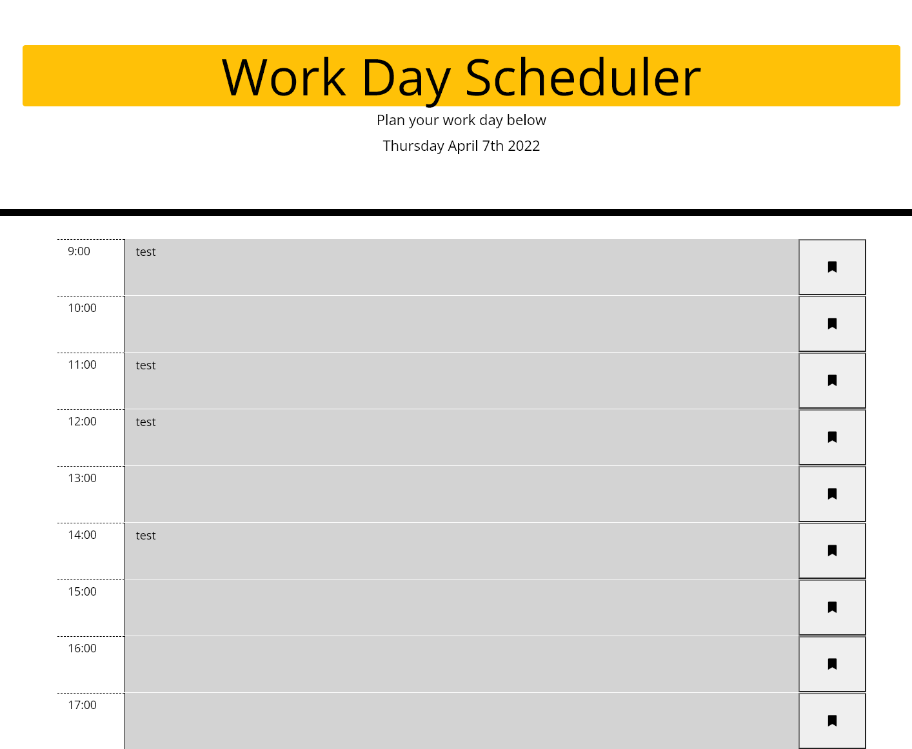

## About:

A web deployed calendar that allows users to input appointments at every hour from 9am to 5pm that is then stored in local storage for later retrieval.

## Links:

https://github.com/mcgidoug/hw5-api-work-day-scheduler

https://mcgidoug.github.io/hw5-api-work-day-scheduler/

